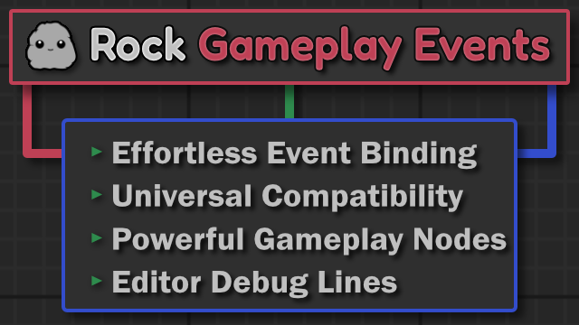

  

  
[![Star][star-image]][star-url]
[![Package License][package-license-image]][package-license-url]
[![Issues][issues-open-image]][issues-url]

# RockGameplayEvents
A relatively simple direct event system for hooking up instanced actors and ability to broadcast events in the level editor.

This system is inspired by UEFN, Source, and many other game engines that provide a similiar system but sadly UE does not, outside of the Level Blueprint.

# The problem we are trying to solve
Connect the output event from an actor, to trigger a function on another actor.  Without any required setup, interfaces, or extra components.

Some common scenarios might be as simple as hooking up a lightswitch to various lights, or a lever to unlock a door.

# Why you should use this plugin

* If you want to connect an broadcastable event from an actor to another in the editor. 
* If you want to accomplish this with ANY actor, no components and no interfaces.

TriggerActor: Have an appropriate Delegate(e.g. MulticastDelegate) and to add a URockDelegateConnectorComponent to the actor. This can be added per instanced actor or blueprint attached.
ReceiverActor: Have a matching function signature to the trigger's selected delegate. 

This system will work with any existing delegates and functions. No registration, no additional setup required.

# How does it look in the editor?

# Other solutions

There are other great event systems out there that either solve similiar but different problems or have different design goals.

## Lyra's GameplayMessageSubsystem
This works well for a global system that you setup using Channels ahead of time. Good for highscores, and larger sweeping changes
Our modified version of it https://github.com/brokenrockstudios/GameplayMessageRouter

## Todo: Add more examples here

# License

Any portions of the code that are not covered by Epic's EULA are licensed under the MIT License, as specified in the LICENSE file.

- Unreal Engine EULA: https://www.unrealengine.com/eula
- Unreal Engine Content EULA: https://www.unrealengine.com/eula/content

# Credit

* Inspiration came from UEFN's Direct Event Binding
* Inspiration came from Valve's Source Engine Trigger System
* Inspiration came from Minecraft's Redstone System
* ben🍃ui's recent tutorial https://benui.ca/unreal/choosing-function-in-editor/

# Similiar Products

* [ActorIO](https://github.com/HorizonGamesRoland/ActorIO/tree/main)
    * Most similiar. Has slightly different design goals.
* [LEventDelegate](https://github.com/liufei2008/LEventDelegate/tree/5.2)
    * Somewhat similiar, less flexible.
* [Interactive Lights System](https://www.fab.com/listings/e1062ebc-abd9-4688-bedc-c34ba95409a6)
    * Lights only. Requires to use their custom actors (Switches and lights)
* Interaction only [EasyInteractionSystem](https://www.fab.com/listings/dbb8f567-d3cd-43e9-8e9d-3bfceb2eaff9)
    * Interaction system. Not universal.

# Contribute!

I'd love to further refine or polish this off for a wider audience. I invite everyone to either request features or make suggestions or contribute via PR. 

[star-url]: https://github.com/brokenrockstudios/RockGameplayEvents/stargazers
[star-image]: https://img.shields.io/github/stars/brokenrockstudios/RockGameplayEvents?label=stars&style=plastic&color=blue
[package-license-url]: https://opensource.org/licenses/MIT
[package-license-image]: https://img.shields.io/badge/License-MIT-blue.svg?style=plastic&color=green
[issues-open-image]: https://img.shields.io/github/issues/brokenrockstudios/RockGameplayEvents?label=Issues&style=plastic
[issues-url]: https://github.com/brokenrockstudios/RockGameplayEvents/issues
